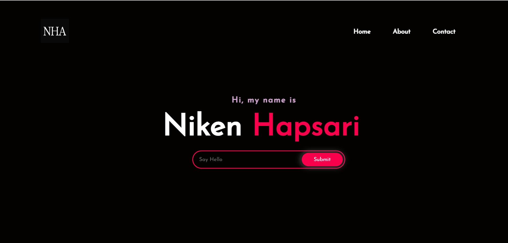
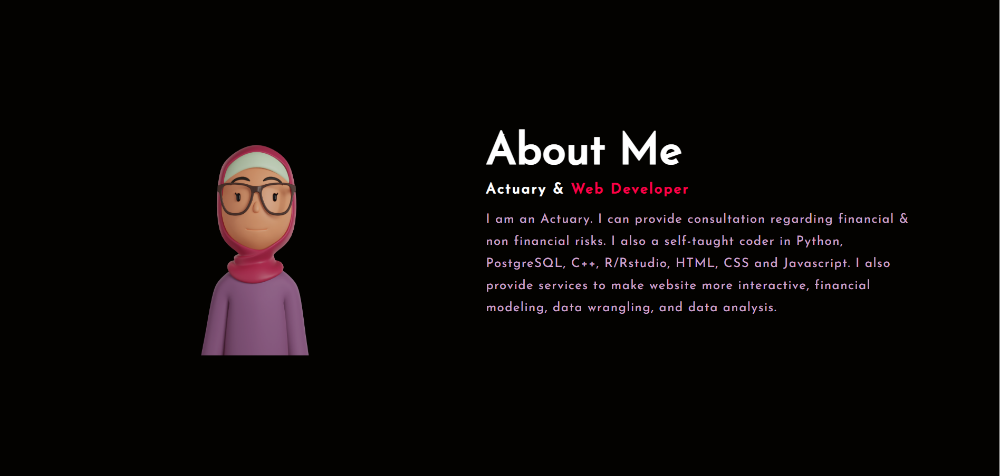

# Niken Hapsari's Website

> Assignment for week 1: Personal Website

## 📢Description

This is a simple personal website of **Niken Hapsari** using HTML, CSS, and a little bit JavaScript

## 💻Live Preview

https://nikenhpsr.netlify.app/

## 📄 Pages

- Home
- About
- Contact

## 🔎 Screenshots

## 🚥Colors Used

| Name        | Code    |
| :---------- | :------ |
| Black       | #030200 |
| White       | #FFFFFF |
| Pinkish Red | #F9004D |
| Soapstone   | #FCFC   |

## References

- Color names : [ArtyClick Colors](https://colors.artyclick.com/color-name-finder/)
- Color palette : [Dopely Colors - Chrome Extentions](https://colors.dopely.top/)
- Font used : [Josefin Sans](https://fonts.googleapis.com/css?family=Josefin%20Sans)
